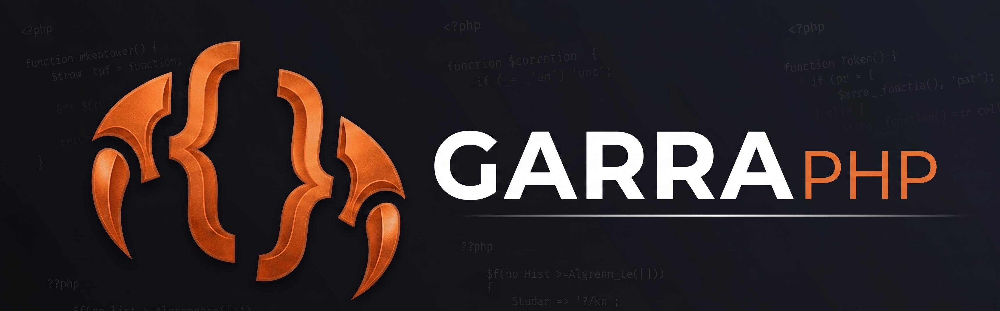

<p align="center">
  
</p>

# 爪 GarraPHP

**Scrappy. Strong. Agentic.**

GarraPHP is a minimalist AI agent framework designed to bring autonomous "Claw-style" capabilities to the most basic hosting environments. While other frameworks require VPS access, background loops, or complex Node.js runtimes, GarraPHP is built to run on the standard PHP request/response cycle.

If you can host a WordPress site, you can host an AI agent.

---

## ⚡ Why GarraPHP?

Most agentic systems are "always-on" heavyweights. **GarraPHP** (Portuguese for *grit* or *claw*) is built for the "low-hanging fruit" of the web:

- **Shared Hosting Ready** — Works on standard cPanel/basic hosting without SSH root access.
- **Zero Footprint** — No background processes, WebSockets, or Node.js required.
- **Synchronous Execution** — Triggered by webhooks, cron jobs, or direct HTTP requests.
- **Provider-Agnostic** — Switch between OpenAI, Anthropic (Claude), Google Gemini, or Ollama with one line in config.
- **Auto-Discovery Skills** — Drop a `.php` file into `/skills` and it's live. No registration, no config.
- **WordPress-Native** — Reads credentials directly from `wp-config.php`. Ships with a shortcode plugin.

---

## 📁 Project Structure

```
/
├── src/
│   ├── public_html/          # Files served by Apache (public)
│   │   ├── index.php         # Agent API endpoint (POST /index.php)
│   │   ├── dashboard.php     # Control room UI
│   │   ├── setup.php         # Guided configurator (password-protected)
│   │   ├── ui.php            # Minimal chat interface
│   │   ├── cron.php          # Scheduler runner (hit every 5 min)
│   │   └── .htaccess         # Blocks all PHP except whitelisted files
│   │
│   └── garra/                # Engine — NOT in public_html
│       ├── garra.php         # Core agent loop (think → act → observe)
│       ├── config.php        # All credentials and settings
│       ├── drivers/          # LLM provider drivers
│       │   ├── LLMDriver.php         # Abstract base
│       │   ├── OpenAIDriver.php      # OpenAI + compatible APIs
│       │   ├── AnthropicDriver.php   # Claude (Anthropic)
│       │   ├── GeminiDriver.php      # Google Gemini
│       │   └── OllamaDriver.php      # Ollama (local)
│       ├── skills/           # Auto-discovered tools
│       │   ├── weather.php   # Open-Meteo weather (no API key)
│       │   ├── heartbeat.php # URL monitoring and uptime history
│       │   ├── scheduler.php # MySQL-backed job scheduling
│       │   ├── database.php  # Generic MySQL read/write
│       │   ├── email.php     # SMTP / Mailgun / SendGrid
│       │   ├── webhook.php   # Outbound HTTP (Zapier, Make, n8n, Slack)
│       │   └── tasks.php     # Project task breakdown and tracking
│       ├── storage/          # Sessions, logs, heartbeat history (writable)
│       └── garraphp-wordpress-plugin.php
```

---

## 🚀 Installation

### Requirements

- PHP 8.0+
- cURL extension
- PDO MySQL extension *(optional — required for scheduler and tasks)*
- OpenSSL extension *(for HTTPS and SMTP TLS)*
- A writable `storage/` directory

### Steps

**1. Upload files**

```
your-domain.com/
├── public_html/        ← upload contents of src/public_html/ here
│   ├── index.php
│   ├── dashboard.php
│   ├── setup.php
│   ├── ui.php
│   ├── cron.php
│   └── .htaccess
│
└── garra/              ← upload contents of src/garra/ here (OUTSIDE public_html)
    ├── garra.php
    ├── config.php
    ├── drivers/
    ├── skills/
    └── storage/        ← set permissions to 755 or 775
```

**2. Set storage permissions**

In cPanel File Manager, right-click `storage/` → Change Permissions → `755`.
If not writable, try `775`.

**3. Run setup**

Visit `https://yourdomain.com/setup.php` and complete the 6-step configurator:

| Step | What it does |
|------|-------------|
| 1 — Environment | Probes PHP version, extensions, file permissions. Set admin password here. |
| 2 — LLM | Choose provider, enter API key, test connection. |
| 3 — Database | MySQL credentials or auto-read from `wp-config.php`. Creates tables. |
| 4 — Email | SMTP, Mailgun, or SendGrid. Tests connection before saving. |
| 5 — Agent | System prompt, iteration limit, timeout. |
| 6 — Deploy | Writes `config.php`, generates cron command, links to dashboard. |

**4. Add the cron job**

In cPanel → Cron Jobs, add (every 5 minutes):

```
*/5 * * * * curl -s "https://yourdomain.com/cron.php?secret=YOUR_SECRET" > /dev/null 2>&1
```

The exact command is shown on Step 6 of setup — just copy and paste.

---

## 🎛️ Dashboard

Visit `https://yourdomain.com/dashboard.php` after setup.

| Panel | What it shows |
|-------|--------------|
| **Pulse** | LLM status + latency, DB status, job counts, heartbeat summary, recent cron runs, loaded skills. Auto-refreshes every 30s. |
| **Scheduler** | Full job table, run-now button, cancel, new job modal. |
| **Tasks** | Kanban board per project — Pending / In Progress / Blocked / Done. Click a card to cycle status. |
| **Heartbeat** | Per-target status, response time, uptime sparklines, manual ping. |
| **CLI** | Run any goal manually, inspect the full agent loop trace (tool calls, results, elapsed time). Session-persistent per browser tab. |

The **Activity Log** on the right polls every 5 seconds and shows every goal, tool call, result, and error in real time.

---

## 🔌 LLM Providers

Set `provider` in `config.php` or choose during setup.

| Provider | `provider` value | Notes |
|----------|-----------------|-------|
| OpenAI | `openai` | GPT-4o, GPT-4o-mini, etc. |
| Anthropic | `anthropic` | Claude Sonnet, Haiku, Opus |
| Google Gemini | `gemini` | gemini-2.0-flash, gemini-1.5-pro |
| Ollama | `ollama` | Any local model (llama3, mistral, qwen2.5) |

Adding a new provider: create `drivers/YourproviderDriver.php` extending `LLMDriver`, implement `chat()` and `formatTools()`. Set `provider: yourprovider` in config. Done.

---

## 🛠️ Built-in Skills

Skills are auto-discovered from `garra/skills/`. Every file must export two functions: `{name}_definition()` returning the JSON Schema, and `{name}_execute(array $args)` doing the work.

| Skill | What it does |
|-------|-------------|
| `weather` | Current weather for any city via Open-Meteo (no API key needed) |
| `heartbeat` | Ping URLs, check status/response time, keyword match, uptime history |
| `scheduler` | Create, list, cancel scheduled jobs. Recurrence: hourly/daily/weekly/monthly |
| `database` | MySQL SELECT, INSERT, UPDATE. WordPress-aware. Parameterised queries only |
| `email` | Send via SMTP, Mailgun, or SendGrid. HTML or plain text |
| `webhook` | POST JSON to any URL. Slack/Discord message formatting. Retry logic. Host allowlist |
| `tasks` | Break goals into subtasks, store in MySQL, track status on a kanban board |

### Writing a custom skill

```php
<?php
if (!defined('GARRA_EXEC')) exit;

function myskill_definition(): array {
    return [
        'name'        => 'myskill',
        'description' => 'What this skill does — the LLM reads this to decide when to use it.',
        'parameters'  => [
            'type'       => 'object',
            'properties' => [
                'input' => ['type' => 'string', 'description' => 'The input to process'],
            ],
            'required' => ['input'],
        ],
    ];
}

function myskill_execute(array $args): array {
    $input = $args['input'] ?? '';
    // do something
    return ['result' => strtoupper($input)];
}
```

Drop the file in `garra/skills/` — it's live immediately, no registration needed.

---

## 🌐 API

### Run a goal

```http
POST /index.php
Content-Type: application/json
X-Garra-Key: your-api-key   (if auth enabled)

{
  "goal": "What is the weather in Dubai and email me a summary",
  "session_id": "optional-session-id"
}
```

```json
{
  "status": "success",
  "response": "The current weather in Dubai is 38°C with clear skies...",
  "session_id": "optional-session-id"
}
```

### Utility endpoints

```http
GET /index.php?action=ping     → health check
GET /index.php?action=skills   → list loaded skills
```

### Session persistence

Pass the same `session_id` across requests to maintain conversation context. History is stored as JSON in `storage/session_{id}.json`.

---

## 🔒 Security

**Two layers of access control:**

1. **`.htaccess`** — blocks all PHP files at the Apache level except the five whitelisted entry points (`index.php`, `dashboard.php`, `setup.php`, `ui.php`, `cron.php`).
2. **`GARRA_EXEC` constant** — every non-public file checks `if (!defined('GARRA_EXEC')) exit;` at the top.

**Additional protections:**

- `storage/` and `skills/` each have their own `.htaccess` blocking direct access to `.json`, `.jsonl`, and `.lock` files.
- `setup.php` is password-protected after first run. `?unlock=yes` shows a login gate.
- `cron.php` requires a secret token in the query string, generated during setup.
- The `database` skill uses PDO prepared statements exclusively — no raw query interpolation.
- The `webhook` skill validates outbound hosts against an allowlist in `config.php`.
- Auth (`X-Garra-Key`) and rate limiting are available in `config.php` (`auth.enabled`, `rate_limit.enabled`) — both off by default.

---

## 🔗 WordPress Integration

**Option 1 — Auto-read credentials**

Set `wp_config_path` in `config.php` under `database`:

```php
'database' => [
    'wp_config_path' => '/home/user/public_html/wp-config.php',
],
```

GarraPHP reads `DB_NAME`, `DB_USER`, `DB_PASSWORD`, `DB_HOST`, and `$table_prefix` directly — no duplication.

**Option 2 — Shortcode plugin**

Install `garraphp-wordpress-plugin.php` as a WordPress plugin (`wp-content/plugins/garraphp/`), activate it, then set the endpoint URL in Settings → GarraPHP.

```
[garra]
[garra placeholder="Ask me anything about this page"]
[garra session="shared-context"]
```

The plugin also registers a REST endpoint:

```http
POST /wp-json/garra/v1/run
{ "goal": "Summarise the latest 5 posts" }
```

---

## ⚙️ Configuration Reference

`garra/config.php` — all settings in one place.

```php
[
  'provider'  => 'openai',           // openai | anthropic | gemini | ollama
  'model'     => 'gpt-4o-mini',
  'api_key'   => 'sk-...',
  'base_url'  => 'https://api.openai.com/v1',

  'settings'  => [
    'max_iterations' => 5,            // agent loop hard cap
    'timeout'        => 25,           // cURL timeout in seconds
    'skills_dir'     => '...',        // auto-set by setup
    'storage_dir'    => '...',        // auto-set by setup
  ],

  'auth' => [
    'enabled' => false,               // set true to require X-Garra-Key
    'keys'    => ['your-key' => ['label' => 'WordPress']],
  ],

  'rate_limit' => [
    'enabled' => false,
    'window'  => 60,                  // seconds
    'limit'   => 20,                  // requests per window per IP/key
  ],

  'database'  => [ ... ],             // MySQL credentials or wp_config_path
  'email'     => [ ... ],             // driver + SMTP/Mailgun/SendGrid config
  'heartbeat' => [ ... ],             // monitoring targets
  'scheduler' => ['cron_secret' => '...'],
  'webhook'   => ['allowed_hosts' => ['hooks.zapier.com']],
  'system_prompt' => 'You are ...',   // agent persona and instructions
]
```

---

## 🗄️ Database Tables

Created automatically by setup or on first use.

| Table | Purpose |
|-------|---------|
| `garra_jobs` | Scheduled job queue |
| `garra_job_runs` | Execution log for each job run |
| `garra_tasks` | Project task breakdown and status tracking |

---

## 📋 Changelog

### Current
- Guided 6-step setup wizard with environment probe, connectivity tests, and cron command generator
- Password-protected setup re-entry (`setup.php?unlock=yes`)
- Control room dashboard: Pulse, Scheduler, Tasks, Heartbeat, CLI panels
- Real-time Activity Log (polls `storage/activity.log` every 5s)
- Session-persistent CLI with per-tab session ID and reset button
- Google Gemini driver with full tool calling and `thought_signature` support
- 7 built-in skills: weather, heartbeat, scheduler, database, email, webhook, tasks
- WordPress plugin with `[garra]` shortcode and REST API endpoint
- API key auth and file-based rate limiting (opt-in)
- SMTP test in setup with SiteGround/port 465 detection

### v0.1 (initial)
- Synchronous agent loop on shared hosting
- Provider-agnostic driver pattern (OpenAI, Anthropic, Ollama)
- Auto-discovery skill system
- File-based session persistence

---

## 🤝 Contributing

Skills are the easiest entry point — two functions, one file, no framework knowledge needed. See the custom skill example above.

For drivers, extend `LLMDriver` and implement `chat()` and `formatTools()`. Look at `OllamaDriver.php` for the simplest example (it inherits OpenAI's wire format and only overrides SSL handling).

---

## 📄 License

MIT — use it, fork it, build on it.
